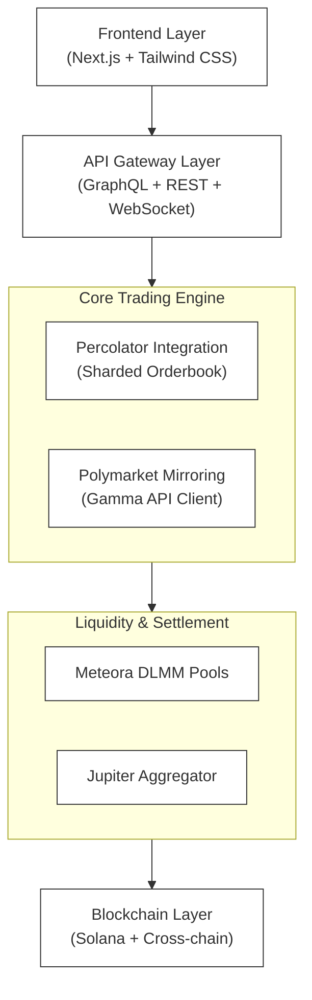

# Moxie: Permissionless Perpetual Prediction Market DEX on Solana

## Executive Summary

Moxie is a decentralized perpetual futures exchange built on Solana that enables users to trade Polymarket outcomes with native SOL, offering up to 50x leverage without requiring bridge transactions or USDC conversions. The platform combines prediction market accessibility with professional trading capabilities through a sharded orderbook architecture and cross-chain liquidity aggregation.

## Table of Contents

- [Architecture Overview](#architecture-overview)
- [Core Components](#core-components)
- [Technical Stack](#technical-stack)
- [Installation](#installation)
- [Development](#development)
- [API Documentation](#api-documentation)
- [Security](#security)
- [License](#license)

## Architecture Overview

### System Architecture

Moxie implements a multi-layered architecture optimized for high-frequency trading and cross-chain operations:



### Key Design Principles

1. **Zero-Friction Trading**: Native SOL trading without bridge or conversion requirements
2. **Composability**: Modular architecture enabling integration with existing Solana DeFi protocols
3. **Scalability**: Sharded orderbook design supporting parallel execution
4. **Security**: On-chain settlement with isolated risk management per market

## Core Components

### 1. Polymarket Integration Service

Responsible for real-time synchronization with Polymarket markets:

- **Gamma API Client**: Fetches market metadata, prices, and volumes
- **CLOB Bridge**: Executes cross-chain orders via Polymarket's order book
- **State Synchronizer**: Maintains consistency between chains
- **Event Processor**: Handles resolution and payout events

### 2. Percolator Trading Engine

Implements high-performance perpetual futures trading:

- **Router Program**: Global margin management and cross-slab routing
- **Slab Engines**: Independent, parallel orderbooks per market
- **Liquidation Engine**: Automated position liquidation with MEV protection
- **Funding Rate Calculator**: Dynamic funding payments based on spot-perp basis

### 3. Liquidity Management

Provides deep liquidity through multiple mechanisms:

- **Meteora DLMM Integration**: Concentrated liquidity with dynamic fees
- **Jupiter Routing**: Optimal swap paths for entry/exit
- **Cross-margin System**: Portfolio-level margin netting
- **LP Incentives**: Yield optimization for liquidity providers

### 4. Copy Trading Module

Social trading features for user acquisition:

- **Trader Analytics**: Performance tracking and leaderboard
- **Position Replication**: One-click copy with custom parameters
- **Revenue Sharing**: Automated performance fee distribution
- **Risk Controls**: Position limits and stop-loss enforcement

### 5. AI Integration Layer

Powered by X/Grok API for enhanced trading intelligence:

- **Sentiment Analysis**: Real-time X feed processing per market
- **Probability Adjustments**: ML-based odds refinement
- **Trade Suggestions**: AI-powered portfolio recommendations
- **Whale Alerts**: Large position movement notifications

## Technical Stack

### Backend Infrastructure

- **Runtime**: Rust (Solana programs), Node.js (API services)
- **Blockchain**: Solana mainnet-beta
- **Database**: PostgreSQL (metadata), Redis (caching)
- **Message Queue**: Apache Kafka (event streaming)
- **Monitoring**: Prometheus + Grafana

### Smart Contracts

- **Language**: Rust with Anchor framework
- **Programs**:
  - `moxie-router`: Main routing and margin program
  - `moxie-perp`: Perpetual futures logic
  - `moxie-pool`: Liquidity pool management
  - `moxie-governance`: DAO and fee distribution

### Frontend Stack

- **Framework**: Next.js 14 with App Router
- **Styling**: Tailwind CSS + Radix UI
- **State Management**: Zustand
- **Wallet Integration**: Phantom, Backpack, Solflare SDKs
- **Charts**: TradingView Lightweight Charts

### External Integrations

- **Polymarket**: Gamma API + py-clob-client
- **Jupiter**: Swap API v6 + CPI interface
- **Meteora**: DLMM SDK + liquidity hooks
- **Pyth**: Price oracles
- **UMA**: Optimistic oracle for resolutions

## Installation

### Prerequisites

- Rust 1.75+ with Solana toolchain
- Node.js 20+ and pnpm
- Docker and Docker Compose
- Solana CLI tools
- PostgreSQL 15+

### Environment Setup

```bash
# Clone repository
git clone https://github.com/thetruesammyjay/Moxie.git
cd Moxie

# Install dependencies
pnpm install
cargo build --release

# Configure environment
cp .env.example .env
# Edit .env with your configuration

# Database setup
docker-compose up -d postgres redis
pnpm db:migrate

# Deploy programs (testnet)
anchor build
anchor deploy --provider.cluster devnet
```

### Running Services

```bash
# Start all services
docker-compose up

# Or run individually:
pnpm dev:api      # API server
pnpm dev:web      # Frontend
pnpm dev:indexer  # Blockchain indexer
pnpm dev:engine   # Trading engine
```

## Development

### Project Structure

```
Moxie/
├── programs/               # Solana smart contracts
│   ├── moxie-router/      # Main routing program
│   ├── moxie-perp/        # Perpetual futures
│   ├── moxie-pool/        # Liquidity pools
│   └── moxie-governance/  # DAO contracts
├── packages/              # Shared libraries
│   ├── sdk/              # TypeScript SDK
│   ├── math/             # Trading math utilities
│   └── types/            # Shared type definitions
├── services/             # Microservices
│   ├── api/              # GraphQL/REST API
│   ├── indexer/          # Blockchain indexer
│   ├── engine/           # Trading engine
│   ├── liquidator/       # Liquidation bot
│   └── market-maker/     # MM strategies
├── apps/                 # Applications
│   ├── web/             # Main web interface
│   ├── mobile/          # React Native app
│   └── trading-terminal/ # Advanced trading UI
├── infrastructure/      # Deployment configs
│   ├── docker/         # Docker configurations
│   ├── kubernetes/     # K8s manifests
│   └── terraform/      # Infrastructure as code
└── docs/               # Documentation
```

### Development Workflow

1. **Feature Development**
   ```bash
   git checkout -b feature/your-feature
   # Make changes
   pnpm test
   pnpm lint
   git commit -m "feat: description"
   ```

2. **Testing**
   ```bash
   # Unit tests
   pnpm test:unit
   
   # Integration tests
   pnpm test:integration
   
   # E2E tests
   pnpm test:e2e
   
   # Solana program tests
   anchor test
   ```

3. **Deployment**
   ```bash
   # Staging
   pnpm deploy:staging
   
   # Production (requires approval)
   pnpm deploy:production
   ```

## API Documentation

### REST Endpoints

#### Market Data
```http
GET /api/v1/markets
GET /api/v1/markets/{marketId}
GET /api/v1/markets/{marketId}/orderbook
GET /api/v1/markets/{marketId}/trades
GET /api/v1/markets/{marketId}/funding
```

#### Trading
```http
POST /api/v1/orders
DELETE /api/v1/orders/{orderId}
GET /api/v1/positions
POST /api/v1/positions/{positionId}/close
```

#### Copy Trading
```http
GET /api/v1/traders/leaderboard
POST /api/v1/copy/{traderId}
DELETE /api/v1/copy/{copyId}
```

### WebSocket Streams

```javascript
// Market data stream
ws://api.moxie.fi/v1/ws

// Subscription message
{
  "op": "subscribe",
  "channel": "orderbook",
  "market": "polymarket_election_2024"
}

// Response format
{
  "type": "orderbook",
  "market": "polymarket_election_2024",
  "bids": [[price, size], ...],
  "asks": [[price, size], ...],
  "timestamp": 1234567890
}
```

### GraphQL API

```graphql
# Example query
query GetMarket($id: String!) {
  market(id: $id) {
    id
    title
    volume24h
    openInterest
    fundingRate
    indexPrice
    markPrice
    positions {
      side
      size
      entryPrice
      unrealizedPnl
    }
  }
}
```

## Security

### Audit Status

- **Smart Contracts**: Pending audit by [Audit Firm]
- **Infrastructure**: SOC 2 Type II compliant
- **Bug Bounty**: Up to $500,000 via Immunefi

### Security Measures

1. **Multi-signature Operations**: Critical functions require 3/5 multisig
2. **Rate Limiting**: API and transaction throttling
3. **Position Limits**: Max leverage and position size caps
4. **Emergency Pause**: Circuit breakers for volatile markets
5. **Oracle Redundancy**: Multiple price feed sources

### Risk Management

- **Isolated Margin**: Per-market risk isolation
- **Auto-Deleveraging**: Systematic risk reduction
- **Insurance Fund**: Protocol-owned backstop
- **Gradual Liquidations**: Partial position unwinding

## Contributing

We welcome contributions! Please see [CONTRIBUTING.md](./CONTRIBUTING.md) for guidelines.

### Development Setup

1. Fork the repository
2. Create a feature branch
3. Make your changes with tests
4. Submit a pull request

### Code Standards

- Follow Rust official style guide
- TypeScript with strict mode enabled
- 100% test coverage for critical paths
- Documentation for all public APIs

## Roadmap

### Q4 2025
- [x] Testnet launch
- [x] Polymarket mirroring
- [ ] 20x leverage perps
- [ ] Audit completion

### Q1 2026
- [ ] Mainnet launch
- [ ] Copy trading release
- [ ] Permissionless markets
- [ ] Mobile app launch

### Q2 2026
- [ ] Injective integration
- [ ] 50x leverage
- [ ] Options trading
- [ ] $500M weekly volume target

## License

MIT License - see [LICENSE](./LICENSE) file for details.

## Contact


---


**Disclaimer**: This software is in active development. Use at your own risk. Not available in restricted jurisdictions.

